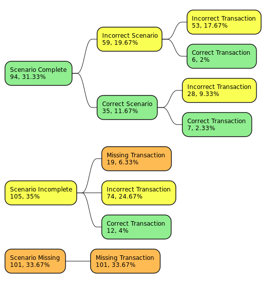

# Large Language Models for Code Generation of Plain Text Accounting with Domain Specific Languages

**Type:** Master's Thesis

**Author:** Julius Freidank

**1st Examiner:** Prof. Dr. Stefan Lessmann 

**2nd Examiner:** Prof. Dr. Benjamin Fabian


## Table of Content

- [Summary](#summary)
- [Working with the repo](#working-with-the-repo)
    - [Dependencies](#dependencies)
    - [Setup](#setup)
- [Reproducing results](#reproducing-results)
    - [Running experiments](#running-experiments)
    - [Data Processing](#data-processing)
    - [Sampling](#sampling)
    - [Transaction Evaluation](#transaction-evaluation)
- [Results](#results)
- [Project structure](#project-structure)

## Summary
The aim of this thesis is to evaluate the capabilities of large language models to
generate code of plain text accounting domain-specific languages (DSLs). We
choose Beancount (Blais, 2023) as the DSL to be evaluated because of the native
python integration. We compare models that are specialized in code generation
with general-purpose models. To facilitate this we let the different models gen-
erate accounting scenarios and have them generate plain text transactions based
on them. We find that the models specialized in code generation fail this task
as a whole. On the other hand, the general-purpose models perform poorly in
both tasks. In total we find that only 2.3% of scenario-transaction combinations
are correct. In addition, the results offer hardly any original concepts and instead
rely heavily on received examples. This points to significant weaknesses and lim-
itations and raises questions about the practicality and the costs and benefits of
LLMs for plain text accounting in real-world applications.

**Keywords**: Large Language Models, Domain-Specific Languages, Beancount, Accounting, vLLM

## Working with the repo

### Dependencies

The code was written using Python 3.10 on Linux. Dependencies are included in the `requirements.txt`.

### Setup

1. Clone this repository

2. Create an virtual environment and activate it
```bash
python -m venv thesis-env
source thesis-env/bin/activate
```

3. Install requirements
```bash
pip install --upgrade pip
pip install -r requirements.txt
```

4. Storing Huggingface Token
To access the models from Huggingface a token is needed, which has to be stored in a `HF_TOKEN` environmental variable.

Example Linux (Temporary (Only for the Current Session)):
```bash
export HF_TOKEN="your_hugging_face_token_here"
```

## Reproducing Results

The original code was run on an Nvidia A100 on a Kubernetes cluster.

### Running Experiments

`run_experiments.py` provides the code used to run the chats with the different LLMs.

The hyperparameters can be configured using the following arguments:

- `--model`: Model name from Hugging Face (**Required**)
- `--companies`: Company from which the balance sheet is drawn (Airbus, Bayer, Deutsche_Telekom, Mercedes-Benz, SAP)  
  *Default: all*
- `--ratios`: Ratios used for experiments (current_ratio, quick_ratio, cash_ratio)  
  *Default: all*
- `--max_tokens`: Maximum number of tokens to generate  
  *Default: 8192*
- `--temperature`: Controls randomness  
  *Default: 0*
- `--top_p`: Controls the cumulative probability of the top tokens to consider  
  *Default: 0.95*
- `--dtype`: Data type for weights and activations  
  *Default: bfloat16*
- `--gpu_memory_utilization`: Ratio of GPU memory to reserve for model weights, activations, and KV cache  
  *Default: 0.9*
- `--output_dir`: Output directory for results  
  *Default: /results*

#### Models Tested
- `meta-llama/CodeLlama-7b-Instruct-hf`
- `Qwen/CodeQwen1.5-7B-Chat`
- `mistralai/Mistral-7B-Instruct-v0.3`
- `meta-llama/Meta-Llama-3-8B-Instruct`
- `Qwen/Qwen2-7B-Instruct`

#### Example Usage 
In this example, we run an experiment using Mistral for Airbus and the current and cash ratio:

```bash
python src/run_experiments.py --model mistralai/Mistral-7B-Instruct-v0.3 --companies Airbus --ratios current_ratio cash_ratio
```

### Data Processing
`process_outputs.py` processes the LLM outputs stored in the 75 JSON files. The processed data is stored in `results/csv-files/scenarios.csv`.

**Example Usage**
```bash
python src/process_outputs.py
```

### Sampling
The data is then sampled using `sampler.py`. The script applies stratified sampling, extracting 60 scenario-transaction combinations for each model from scenarios.csv and stores the sampled data in `results/csv-files/scenarios_sampled.csv`.

**Example Usage**
```bash
python src/sampler.py
```

### Transaction Evaluation
`transaction_evaluation.py` appends transactions to the respective Beancount files and saves errors. The different error types are added to the CSV-file and are saved to `results/csv-files/scenarios_compiled.csv`.

The resulting file serves as the basis for the human evaluation of scenarios, which is saved to `results/csv-files/scenarios_evaluated.csv`.

**Example Usage**
```bash
python src/transaction_evaluation.py
```


## Results
The `results` folder contains the model outputs, csv-files and figures.

## Project structure
```bash
├── README.md
├── requirements.txt                                -- required libraries
├── data
    ├── balsheets                                   -- stores beancount files
    └── prompts.json                                -- stores prompts            
├── results
    ├── csv-files                                   -- processed and evaluated data
    ├── figs                                        -- figures
    └── model_outputs                               -- original model outputs
└── src
    ├── process_outputs.py                          -- prepare output
    ├── report.ipynb                                -- output analysis
    ├── run_experiments.py                          -- run experiments 
    ├── sampler.py                                  -- sample processed entries 
    └── transaction_evaluation.py                   -- evaluate transactions           
```
